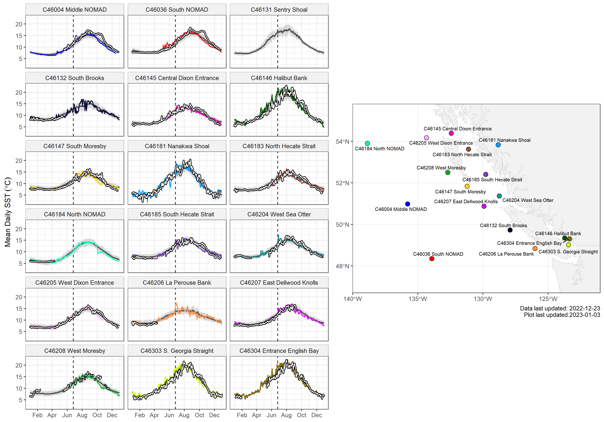

---
## Sea Surface Temperature in the Northeast Pacific
### 2021-2022 buoy temperature plots
---

The 2021 daily mean SST at each buoy are shown as coloured lines, plotted over the buoy climatological mean (grey line) with 10th and 90th percentiles (grey shading). 
The white lines outlined in black are daily mean observations from 2022. 
The beginning of the 2021 "Heat Dome" heatwave is delineated by a dashed vertical line on 2021-06-26. 

