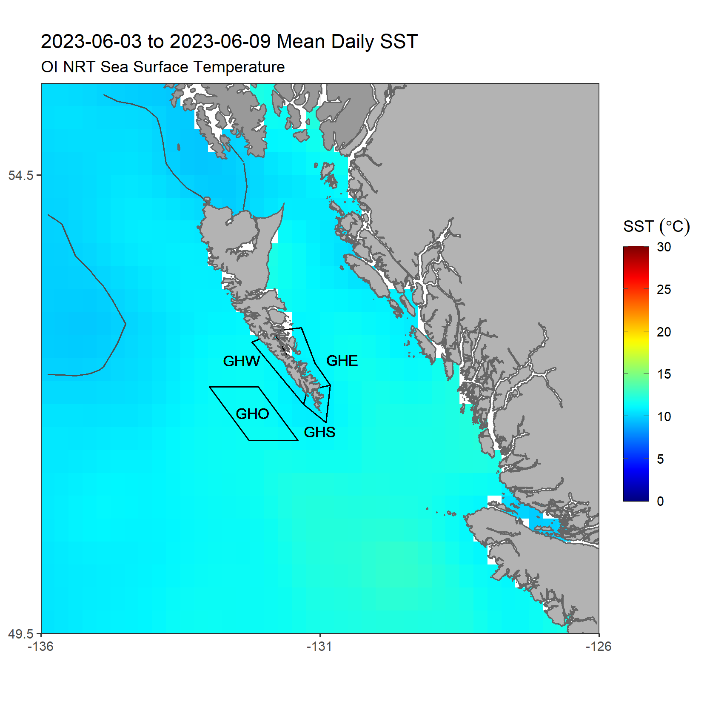

---
# Pacific SST Monitoring
## Haida Gwaii 
---

Maps focused on the Pacific near Haida Gwaii, B.C. The data shown on these maps are identical to the [Pacific SST Monitoring page](https://github.com/BIO-RSG/Pacific_SST_NRT_Monitoring/).
The data shown here can be downloaded in .rds format [here](https://github.com/BIO-RSG/Pacific_SST_NRT_Monitoring/tree/main/data). (*Let me know if you want .csv or other format instead :) *)

### OISST:

 

### MODIS-Aqua NRT SST:

  

##### Number of observations in current week:

 
