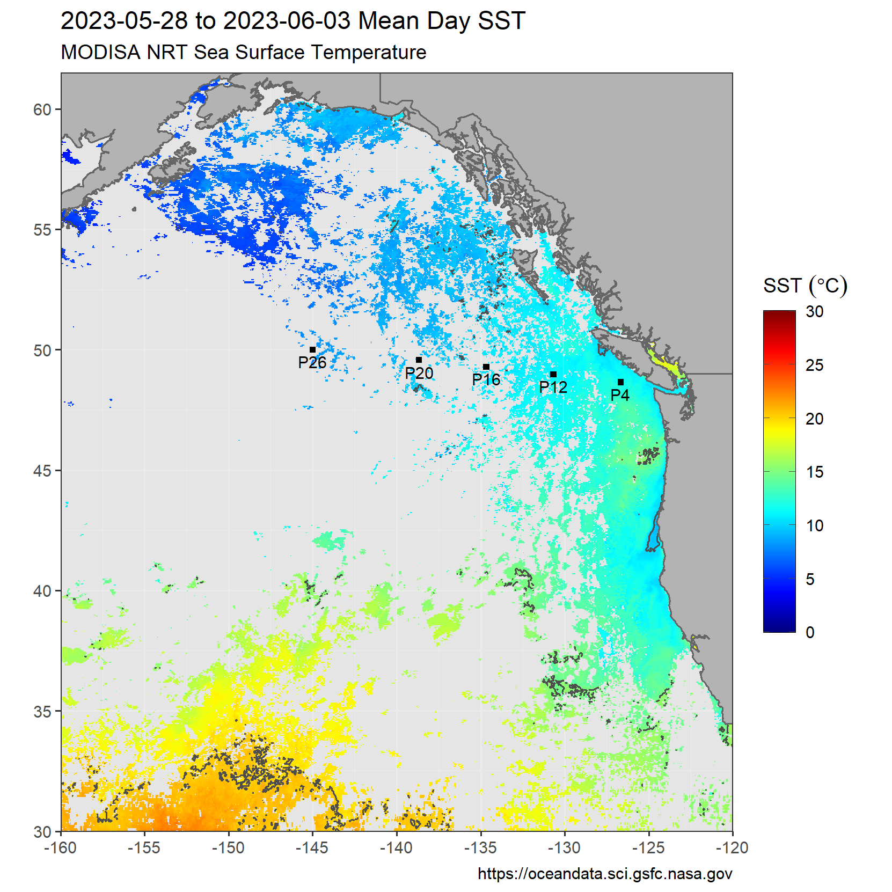
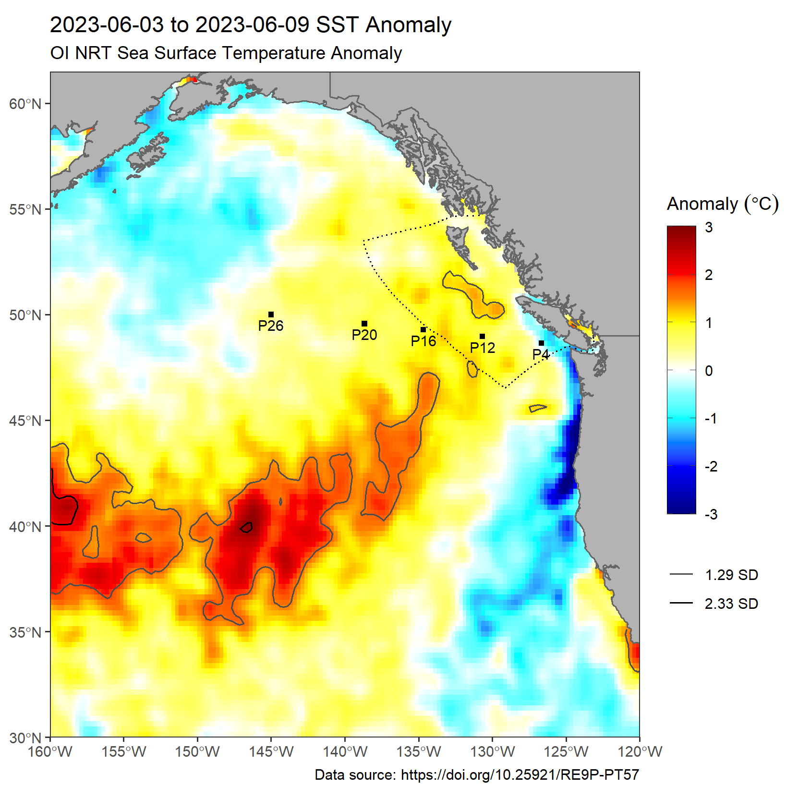

---
# Pacific SST Monitoring
#### Andrea Hilborn
---

These maps show the 7-day mean Sea Surface Temperature (SST, degrees Celsius) and SST anomaly for the Northeast Pacific from the full week of data most recently available. 
Two datasets are shown for comparison - MODIS-Aqua daily SST provided by NASA, and NOAA Optimal Interpolation gap-filled SST (OISST). MODIS-Aqua anomalies were calculated from the corresponding week of data from the 18-year period 2003-2020, and for OISST the 30-year period 1991-2020. Delineated on the anomaly maps is SST exceeding a threshold used for tracking marine heatwaves (>1.29 standard deviations compared to normal, labelled as **1.29 SD**). Data is accessed from the [NOAA CoastWatch ERDDAP server](https://coastwatch.pfeg.noaa.gov/erddap/index.html).

**These figures are provisional and correctness is not guaranteed. :)**

These maps will update on Mondays and Thursdays. A limited number of prior images [can be found here](https://github.com/BIO-RSG/Pacific_SST_NRT_Monitoring/tree/main/figures).

## MODIS-Aqua NRT SST:

The first plot shows 7-day mean daily MODIS-Aqua SST, with contours at 5-degree increments noted on the legend. The second plot is the 7-day anomaly, using the climatology of daily mean SST from **2003-2020** during the same week. The third map shows the number of times each pixel had data in the 7-day time period. 
The spatial resolution is 0.04166 degrees with low quality pixels masked out.

  

##### Number of observations in current week:

 

## OISST:

The first plot is 7-day mean daily OI interpolated SST, with contours at 5-degree increments noted on the legend. The second plot is the 7-day anomaly, calculated by subtracting the mean SST from **1991-2020** during the same week. The spatial resolution is 0.25 degrees.

 

  
## Other data sources, maps and links of interest:

* [Pacific Islands Ocean Observing System](https://www.pacioos.hawaii.edu/voyager/): Near-Real Time data viewer including Coral Reef Watch SST and SST anomaly
* [California Current Marine Heatwave Tracker](https://www.integratedecosystemassessment.noaa.gov/regions/california-current/cc-projects-blobtracker)
* [Global daily SST, 7-day trend and anomaly (NOAA CoralReefWatch)](https://www.ospo.noaa.gov/Products/ocean/cb/sst5km/)
* Old version (2.0) of OI dataset (no longer updated): <https://www.emc.ncep.noaa.gov/research/cmb/sst_analysis/>
* [GOES 1-day, 4-day SST composites](https://ocean.weather.gov/Loops/ocean_guidance.php?model=GOES&area=WasC&plot=sst&day=0&loop=0)
* [NOAA CoastWatch Data Viewer](https://coastwatch.noaa.gov/cw_html/cwViewer.html) and [CoastWatch commonly used SST data sources](https://coastwatch.pfeg.noaa.gov/data.html)
* [NOAA Blob article](https://www.fisheries.noaa.gov/feature-story/new-marine-heatwave-emerges-west-coast-resembles-blob) and [more recent one](https://www.fisheries.noaa.gov/feature-story/looking-back-blob-record-warming-drives-unprecedented-ocean-change)

## References:

* California Current Marine Heatwave Tracker: https://www.integratedecosystemassessment.noaa.gov/regions/california-current/cc-projects-blobtracker
* CoastWatch ERDDAP Server: https://coastwatch.pfeg.noaa.gov/erddap/index.html
* Peter S. Galbraith, Pierre Larouche & Carla Caverhill (2021): A Sea-Surface
Temperature Homogenization Blend for the Northwest Atlantic, Canadian Journal of Remote
Sensing, DOI: 10.1080/07038992.2021.1924645
* Huang, Boyin; Liu, Chunying; Banzon, Viva F.; Freeman, Eric; Graham, Garrett; Hankins, Bill; Smith, Thomas M.; Zhang, Huai-Min. (2020): NOAA 0.25-degree Daily Optimum Interpolation Sea Surface Temperature (OISST), Version 2.1. NOAA National Centers for Environmental Information. https://doi.org/10.25921/RE9P-PT57.
* NASA Goddard Space Flight Center, Ocean Ecology Laboratory, Ocean Biology Processing Group. Moderate-resolution Imaging Spectroradiometer (MODIS) Aqua NRT SST data; NASA OB.DAAC, Greenbelt, MD, USA.
