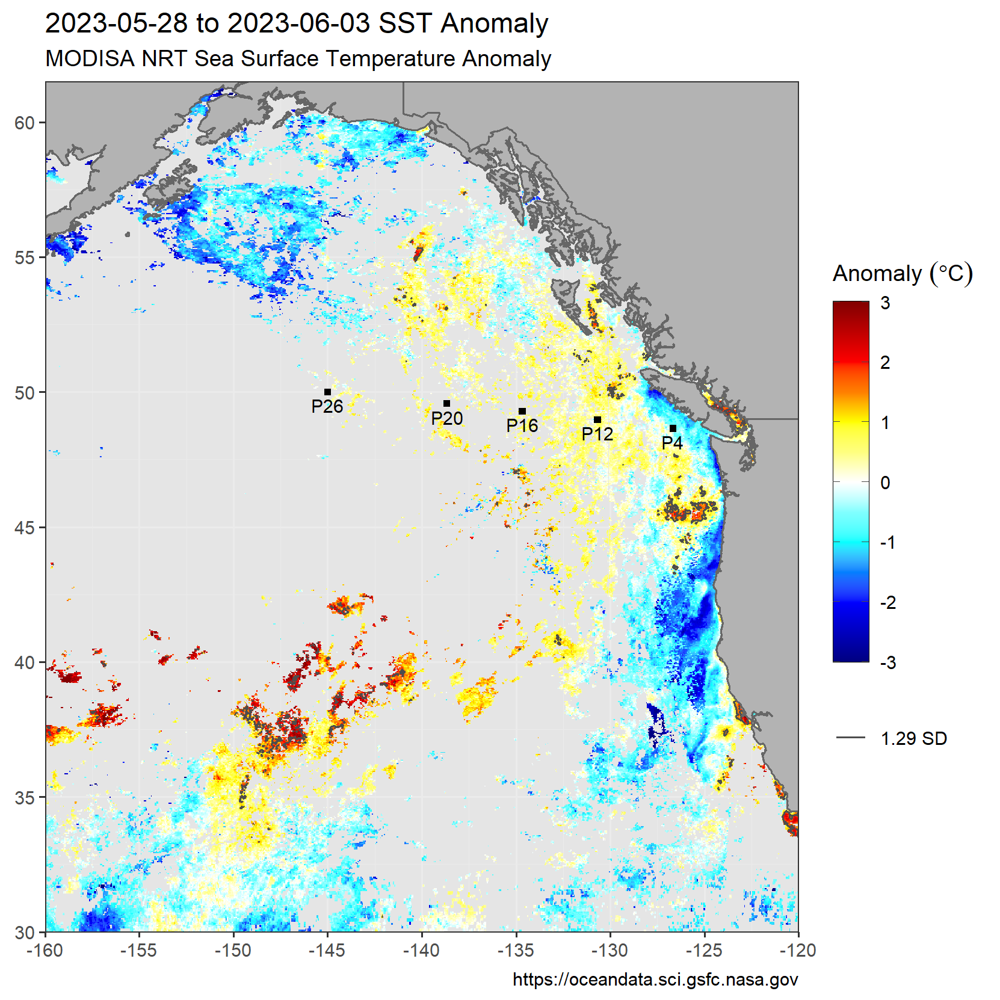
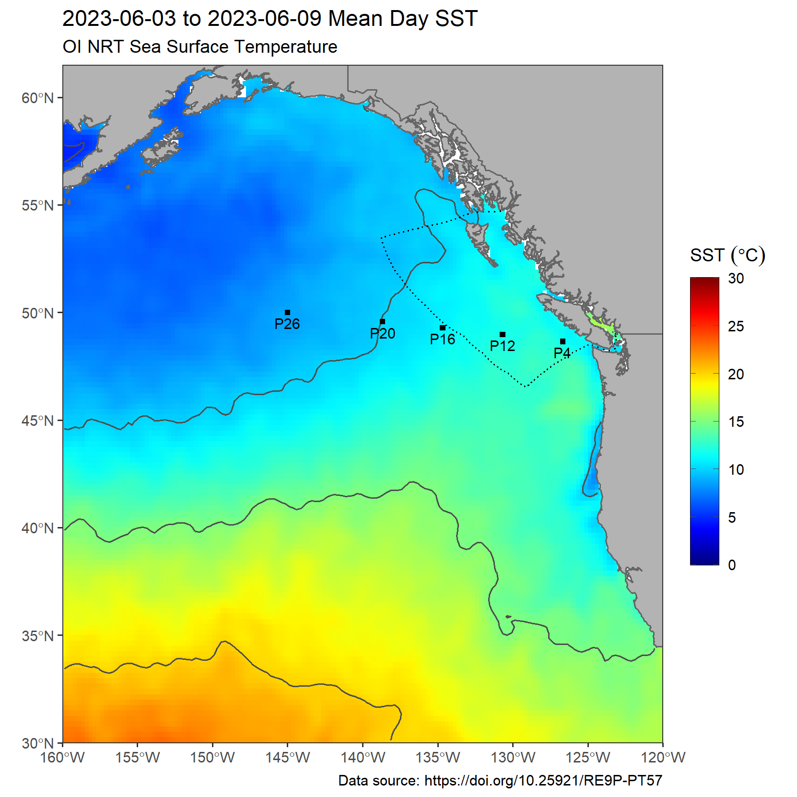

---
# SST Monitoring
### Andrea Hilborn
### Last updated: **2021-05-11**
---

These maps show the mean Sea Surface Temperature (SST, degrees Celsius) and SST anomaly from the latest 7 days of data.
Two datasets are shown here for comparison - MODIS-Aqua daytime SST provided by NASA, and NCDC Optimal Interpolation gap-filled data. Data is accessed via the NOAA CoastWatch ERDDAP server.

## MODIS-Aqua:

The left plot is 7-day mean day-time SST, and right is the 7-day anomaly, when compared to the climatology of mean SST from 2003-2020 during the same week. The third map shows the number of times a given pixel had data in the most recent week.

  

##### Number of observations in current week:

 

## NCDC OI SST:

The left plot is 7-day mean daily SST, and right is the 7-day anomaly, when compared to the climatology of mean SST from 1991-2020 during the same week. The contour on the anomaly map corresponds to pixels that exceed 1.29 times the standard deviation of the climatology for that period.

 

  
## Other data sources, maps and links of interest:

* [California Current Heat Wave Tracker](https://www.integratedecosystemassessment.noaa.gov/regions/california-current/cc-projects-blobtracker)
* [Global daily SST, 7-day trend and anomaly (NOAA CoralReefWatch)](https://www.ospo.noaa.gov/Products/ocean/cb/sst5km/)
* Old version (2.0) of OI dataset (no longer updated): <https://www.emc.ncep.noaa.gov/research/cmb/sst_analysis/>
* [GOES 1-day, 4-day SST composites](https://ocean.weather.gov/Loops/ocean_guidance.php?model=GOES&area=WasC&plot=sst&day=0&loop=0)
* [NOAA CoastWatch Data Viewer](https://coastwatch.noaa.gov/cw_html/cwViewer.html) and [CoastWatch commonly used SST data sources](https://coastwatch.pfeg.noaa.gov/data.html)
* [NOAA Blob article](https://www.fisheries.noaa.gov/feature-story/new-marine-heatwave-emerges-west-coast-resembles-blob) and [more recent one](https://www.fisheries.noaa.gov/feature-story/looking-back-blob-record-warming-drives-unprecedented-ocean-change)

## References:

* California Current Blob Tracker: https://www.integratedecosystemassessment.noaa.gov/regions/california-current/cc-projects-blobtracker
* CoastWatch ERDDAP Server: https://coastwatch.pfeg.noaa.gov/erddap/index.html
