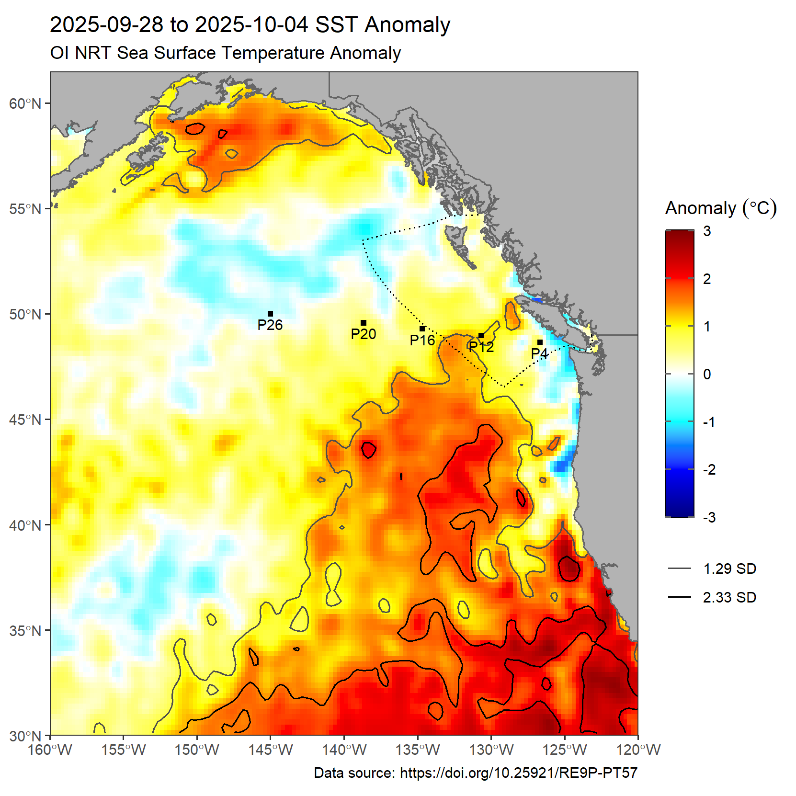

------------------------------------------------------------------------

# Sea Surface Temperature in the Northeast Pacific

### Experimental maps and data of current conditions

##### Andrea Hilborn, Charles Hannah and Lu Guan

This page has weekly maps of satellite Sea Surface Temperature (SST, degrees Celsius) and SST anomalies for the Northeast Pacific, and recent water temperatures from buoys maintained by Environment and Climate Change Canada (ECCC).

**These figures are provisional and correctness is not guaranteed. :)**

These maps update on **Monday** using the most recent week of data. A limited number of prior images [can be found here](https://github.com/BIO-RSG/Pacific_SST_NRT_Monitoring/tree/main/figures). Data shown can be downloaded [here](https://github.com/BIO-RSG/Pacific_SST_NRT_Monitoring/tree/main/data) (GeoTIFF and .rds format).
The climatologies for satellite and buoy data are calculated from the [Canadian Climate Normals](https://climate.weather.gc.ca/climate_normals/) period of **1991-2020**.

#### Contents:

-   [OISST: weekly mean and anomaly](https://github.com/BIO-RSG/Pacific_SST_NRT_Monitoring#oisst)
-   [OISST: MHW conditions in the BCEEZ](https://github.com/IOS-OSD-DPG/Pacific_SST_Monitoring/tree/main?tab=readme-ov-file#mhw-conditions-in-the-eez)
-   [ECCC Buoy Data: daily mean and climatologies](https://github.com/BIO-RSG/Pacific_SST_NRT_Monitoring#eccc-buoy-data)
-   [MODIS-Aqua SST: weekly mean and anomaly](https://github.com/BIO-RSG/Pacific_SST_NRT_Monitoring#modis-aqua-nrt-sst)
-   [Other MHW data and links](https://github.com/BIO-RSG/Pacific_SST_NRT_Monitoring#other-mhw-data-sources-maps-and-links-of-interest)
-   [References](https://github.com/BIO-RSG/Pacific_SST_NRT_Monitoring#references) and [Recent MHW Publications](https://github.com/IOS-OSD-DPG/Pacific_SST_Monitoring/blob/main/docs/MHW_Literature.md)

 
Click here to read background details

### Background:
 
Satellite SST data is accessed from the NOAA CoastWatch [ERDDAP server](https://coastwatch.pfeg.noaa.gov/erddap/index.html).

* **NOAA Optimal Interpolation gap-filled SST (OISST)**: Anomaly maps were calculated using the current week and subtracting the 30-year mean (1991-2020). The spatial resolution is 0.25 degrees (approximately 25 km pixel width).
* **Buoy Surface Temperature**: Surface temperature observations from Canadian Pacific buoys, including detailed quality control information, maintained by ECCC and DFO. The data sources are [Environment and Climate Change Canada (ECCC) buoys]([https://www.canada.ca/en/environment-climate-change/services/general-marine-weather-information/observations/buoy.html](https://www.pac.dfo-mpo.gc.ca/science/oceans/data-donnees/buoydata-donneebouee/index-eng.html)), acquired via CIOOS Pacific (dataset IDs [`DFO_MEDS_BUOYS`](https://data.cioospacific.ca/erddap/info/DFO_MEDS_BUOYS/index.html) and [`ECCC_MSC_BUOYS`](https://data.cioospacific.ca/erddap/info/ECCC_MSC_BUOYS/index.html)). The `DFO_MEDS_BUOYS` record has a detailed quality control layer outlined in [Kellogg et al., 2021](https://catalogue.cioospacific.ca/dataset/ca-cioos_b9c71eb2-b750-43d5-a50a-aee173916736/resource/12786acf-a634-4a5b-9867-2b39c6c11aae).
* **NASA MODIS-Aqua NRT SST**: Anomaly maps were calculated using the current week and subtracting the 18-year mean (2003-2020). The spatial resolution is 0.04166 degrees (~4 km pixel width) with low quality pixels removed. 

## OISST

*5-degree intervals are marked on the SST plot in grey. 
On the anomaly plots the lines indicate 1.29 and 2.33 standard deviations above normal (approximately the upper 90th and 99th percentiles relative to the climatology).
The Canadian Exclusive Economic Zone is indicated with a dashed line.
Points indicate selected stations along [Line-P](https://www.dfo-mpo.gc.ca/science/data-donnees/line-p/index-eng.html).*

:arrow_right: To view map insets near Haida Gwaii click [here](https://github.com/BIO-RSG/Pacific_SST_NRT_Monitoring/tree/main/docs/Haida_Gwaii.md). :arrow_left:

### Latest week of data:

 

### MHW Conditions in the BCEEZ:

*The 2024 MHW spatial coverage of the B.C. Exclusive Economic Zone (EEZ, red) is below, with 2023 coverage shown in grey. The stripes indicate percent area of the EEZ, Northern Shelf Bioregion (NSB) and Southern Shelf Bioregion (SSB) in MHW status for 2024. Download the data from this figure [here](https://github.com/IOS-OSD-DPG/Pacific_SST_Monitoring/blob/main/data/MHW_EEZ_values_2023-2024.csv), and view similar plots for previous years [here](https://github.com/IOS-OSD-DPG/Pacific_SST_Monitoring/blob/main/docs/MHW_Conditions.md).*

 

###### Click here to view map

 

## ECCC Buoy data

*The white lines outlined in black are daily mean observations from the current year. The daily mean SST from the previous year at each buoy are shown as coloured lines, plotted over the buoy climatological mean (grey line) with 10th and 90th percentiles (grey shading).  The climatology spans 1991-2020, though some buoys began collecting data later: `C46146 Halibut Bank`, `C46131 Sentry Shoal`, `C46147 South Moresby` and `C46132 South Brooks`. There is no climatology for `C46303 S. Georgia Strait` and `C46304 Entrance English Bay` as they were installed in 2019.*

:arrow_right: To view 2021-2023 data click [here](https://github.com/BIO-RSG/Pacific_SST_NRT_Monitoring/tree/main/docs/Buoy_temperature.md). :arrow_left:

 

###### Click here to view buoy surface temperature climatologies

 

 

#### Buoy details

*The start dates listed here may not correspond with other sources (e.g. the [ECCC website](https://www.pac.dfo-mpo.gc.ca/science/oceans/data-donnees/buoydata-donneebouee/index-eng.html)) but represent the data record available at the sources listed above, as of December 2023. An up-to-date status report can be viewed here: https://collaboration.cmc.ec.gc.ca/cmc/wbs/bplatstat.html*

Stn ID | Start Date | Longitude| Latitude | 
-------|------------|-----------|--------|
[C46004 Middle NOMAD](https://www.meds-sdmm.dfo-mpo.gc.ca/isdm-gdsi/waves-vagues/data-donnees/data-donnees-eng.asp?medsid=C46004) | 1988-08-04 | -136.10 | 50.93
[C46036 S. NOMAD](https://www.meds-sdmm.dfo-mpo.gc.ca/isdm-gdsi/waves-vagues/data-donnees/data-donnees-eng.asp?medsid=C46036) | 1987-09-22 | -133.94 | 48.35 
[C46131 Sentry Shoal](https://www.meds-sdmm.dfo-mpo.gc.ca/isdm-gdsi/waves-vagues/data-donnees/data-donnees-eng.asp?medsid=C46131) | 1992-10-20 |  -124.99 | 49.91 
[C46132 S. Brooks](https://www.meds-sdmm.dfo-mpo.gc.ca/isdm-gdsi/waves-vagues/data-donnees/data-donnees-eng.asp?medsid=C46132) | 1994-05-05 | -127.93 | 49.74 
[C46145 Central Dixon Entrance](https://www.meds-sdmm.dfo-mpo.gc.ca/isdm-gdsi/waves-vagues/data-donnees/data-donnees-eng.asp?medsid=C46145) |  1991-04-16 | -132.42 | 54.38 
[C46146 Halibut Bank](https://www.meds-sdmm.dfo-mpo.gc.ca/isdm-gdsi/waves-vagues/data-donnees/data-donnees-eng.asp?medsid=C46146) | 1992-03-13  |-123.73 | 49.34 
[C46147 S. Moresby](https://www.meds-sdmm.dfo-mpo.gc.ca/isdm-gdsi/waves-vagues/data-donnees/data-donnees-eng.asp?medsid=C46147) | 1993-06-17 |-131.23 | 51.83
[C46181 Nanakwa Shoal](https://www.meds-sdmm.dfo-mpo.gc.ca/isdm-gdsi/waves-vagues/data-donnees/data-donnees-eng.asp?medsid=C46181) | 1988-11-22 |-128.84 | 53.82 
[C46183 N. Hecate Strait](https://www.meds-sdmm.dfo-mpo.gc.ca/isdm-gdsi/waves-vagues/data-donnees/data-donnees-eng.asp?medsid=C46183) | 1991-05-15 |  -131.14 | 53.57 
[C46184 N. NOMAD](https://www.meds-sdmm.dfo-mpo.gc.ca/isdm-gdsi/waves-vagues/data-donnees/data-donnees-eng.asp?medsid=C46184) | 1987-09-20 | -138.85 | 53.92 
[C46185 S. Hecate Strait](https://www.meds-sdmm.dfo-mpo.gc.ca/isdm-gdsi/waves-vagues/data-donnees/data-donnees-eng.asp?medsid=C46185) | 1991-09-12 | -129.79 | 52.42 
[C46204 W. Sea Otter](https://www.meds-sdmm.dfo-mpo.gc.ca/isdm-gdsi/waves-vagues/data-donnees/data-donnees-eng.asp?medsid=C46204) | 1989-09-07 |  -128.77 | 51.38
[C46205 W. Dixon Entrance](https://www.meds-sdmm.dfo-mpo.gc.ca/isdm-gdsi/waves-vagues/data-donnees/data-donnees-eng.asp?medsid=C46205) | 1988-11-22 | -134.32 | 54.19 
[C46206 La Perouse Bank](https://www.meds-sdmm.dfo-mpo.gc.ca/isdm-gdsi/waves-vagues/data-donnees/data-donnees-eng.asp?medsid=C46206) | 1988-11-22 | -126.00 | 48.83 
[C46207 E. Dellwood](https://www.meds-sdmm.dfo-mpo.gc.ca/isdm-gdsi/waves-vagues/data-donnees/data-donnees-eng.asp?medsid=C46207) | 1989-10-18 |  -129.91 | 50.88 
 [C46208 W. Moresby](https://www.meds-sdmm.dfo-mpo.gc.ca/isdm-gdsi/waves-vagues/data-donnees/data-donnees-eng.asp?medsid=C46208) | 1990-07-12 | -132.69 | 52.51
C46303 S. Georgia Strait |  2019-10-01 |   -123.4300 |  49.02500 
C46304 Entrance English Bay | 2019-10-01 |-123.3570 | 49.30167

 

## MODIS-Aqua NRT SST

  

##### Number of observations in current week:

*Note that pixels with fewer than 2 observations from the week are masked out.*
 
 
 

 
 
## Other MHW data sources, maps and links of interest

 
### SST & Marine Heatwaves:
* [**NOAA Slide Deck, November 2023** Global Ocean Monitoring: Recent Evolution, Current Status, and Predictions](https://origin.cpc.ncep.noaa.gov/products/GODAS/ocean_briefing_gif/global_ocean_monitoring_current.pdf)
* [NOAA Marine Heatwave Forecast Monthly Report](https://psl.noaa.gov/marine-heatwaves/#report)
* [California Current Marine Heatwave Tracker](https://www.integratedecosystemassessment.noaa.gov/regions/california-current/california-current-marine-heatwave-tracker-blobtracker)
* [Marine Heatwaves International Working Group](http://www.marineheatwaves.org/)
* [CIOOS Pacific Marine Heatwave Monitor](https://cioospacific.ca/applied-data/marine-heat-monitor/)
* [Multi-Scale Ultra-High resolution SST Anomaly, Daily](https://coastwatch.pfeg.noaa.gov/erddap/griddap/jplMURSST41anom1day.graph?sstAnom%5B(last)%5D%5B(20.0):(63.0)%5D%5B(-179.99):(-110.0)%5D&amp;.draw=surface&amp;.vars=longitude%7Clatitude%7CsstAnom&amp;.trim=0&amp;.colorBar=%7C%7C%7C%7C%7C&.bgColor=0xffccccff) ***click to view latest image**

* [Climate Reanalyzer Daily Global Sea Surface Temperature](https://climatereanalyzer.org/clim/sst_daily/)
* [Gulf of Maine MHWs](https://www.gmri.org/stories/gulf-of-maine-warming-update-winter-202223/)
* [NOAA Coral Reef Watch: MHW Watch](https://coralreefwatch.noaa.gov/product/marine_heatwave/)
* [NOAA Physical Sciences Lab Map Room: SST](https://psl.noaa.gov/map/clim/sst.shtml)
* [Pacific Islands Ocean Observing System](https://www.pacioos.hawaii.edu/voyager/): Near-Real Time data viewer including Coral Reef Watch SST and SST anomaly
* [Global daily SST, 7-day trend and anomaly (NOAA CoralReefWatch)](https://www.ospo.noaa.gov/Products/ocean/cb/sst5km/)
* [GOES 1-day, 4-day SST composites](https://ocean.weather.gov/Loops/ocean_guidance.php?model=GOES&area=WasC&plot=sst&day=0&loop=0)
* [NOAA CoastWatch Data Viewer](https://coastwatch.noaa.gov/cw_html/cwViewer.html) and [CoastWatch commonly used SST data sources](https://coastwatch.pfeg.noaa.gov/data.html)
* [NOAA Blob article](https://www.fisheries.noaa.gov/feature-story/new-marine-heatwave-emerges-west-coast-resembles-blob) and [more recent one](https://www.fisheries.noaa.gov/feature-story/looking-back-blob-record-warming-drives-unprecedented-ocean-change)

### El Niño:
* [NOAA El Niño Index Dashboard](https://psl.noaa.gov/enso/dashboard.html)
* [NOAA ENSO Blog](https://www.climate.gov/news-features/blogs/enso)
* [Sea Level Key Indicators: El Niño-Southern Oscillation](https://sealevel.jpl.nasa.gov/data/vital-signs/el-nino/)
* [Australian Government Bureau of Meteorology El Niño Watch](http://www.bom.gov.au/climate/enso/index.shtml#tabs=Overview&overview-section=Sea-surface)

### Other:
* [B.C. River Forecast Centre Map of 7-Day Average Streamflow](http://bcrfc.env.gov.bc.ca/lowflow/map_7dayflow.html)
* [Copernicus Climate Indicators](https://climate.copernicus.eu/climate-indicators)
* [Mapped: Attributing extreme weather to climate change](https://www.carbonbrief.org/mapped-how-climate-change-affects-extreme-weather-around-the-world/)

 

## References

* California Current Marine Heatwave Tracker: https://oceanview.pfeg.noaa.gov/projects/mhw/latest
* CoastWatch ERDDAP Server: https://coastwatch.pfeg.noaa.gov/erddap/index.html
* CIOOS Pacific ERDDAP Server: https://data.cioospacific.ca/erddap/index.html
* Galbraith, P.S., Larouche, P. & Caverhill, C. (2021): A Sea-Surface
Temperature Homogenization Blend for the Northwest Atlantic, Canadian Journal of Remote
Sensing, [doi:10.1080/07038992.2021.1924645](https://www.tandfonline.com/doi/full/10.1080/07038992.2021.1924645)
* Hobday, A.J., Alexander, L., Perkins, S., Smale, D.A., Straub, S., Oliver, E., Benthuysen, J.A., Burrows, M., Donat, M.G., Feng, M., Holbrook, N.J., Moore, P.J., Scannell, H., Sen Gupta, A. & Wernberg, T. (2016): A hierarchical approach to defining marine heatwaves. Progress in Oceanography. 141, 227-238, [doi:10.1016/j.pocean.2015.12.014](https://doi.org/10.1016/j.pocean.2015.12.014)
* Hobday, A.J., Oliver, E.C.J., Sen Gupta, A., Benthuysen, J.A., Burrows, M.T., Donat, M.G., Holbrook, N.J., Moore, P.J., Thomsen, M.S., Wernberg, T., & Smale, D.A. (2018): Categorizing and naming marine heatwaves. Oceanography 31(2):162–173, [doi:10.5670/oceanog.2018.205](https://doi.org/10.5670/oceanog.2018.205)
* Kellogg, J., Rosenstock, N., Page, S., Hourston, R., Devred, E. and Hannah, C. (2021): Quality Control of Weather/Wave Buoy Temperature Data Provided by Environment and Climate Change Canada. CIOOS Pacific. [https://catalogue.cioospacific.ca/dataset/ca-cioos_b9c71eb2-b750-43d5-a50a-aee173916736](https://catalogue.cioospacific.ca/dataset/ca-cioos_b9c71eb2-b750-43d5-a50a-aee173916736/resource/12786acf-a634-4a5b-9867-2b39c6c11aae)

For other reading on Marine Heatwaves, check out the [reference list here](https://github.com/BIO-RSG/Pacific_SST_NRT_Monitoring/tree/main/docs/MHW_Literature.md)!

