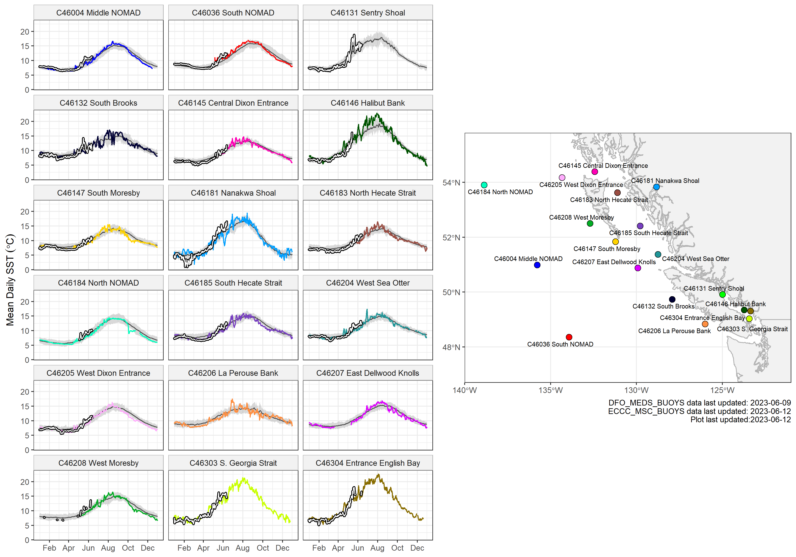

---

# Sea Surface Temperature in the Northeast Pacific
### Experimental maps and data of current conditions
#### Andrea Hilborn and Charles Hannah
---

This page has maps of 7-day mean satellite Sea Surface Temperature (SST, degrees Celsius) and anomalies for the Northeast Pacific, and recent water temperatures from buoys maintained by Environment and Climate Change Canada (ECCC).

#### Contents:

* [NOAA Optimal Interpolation gap-filled SST (OISST).](https://github.com/BIO-RSG/Pacific_SST_NRT_Monitoring#oisst)
* [ECCC Buoy Data](https://github.com/BIO-RSG/Pacific_SST_NRT_Monitoring#eccc-buoy-data)
* [NASA MODIS-Aqua NRT SST](https://github.com/BIO-RSG/Pacific_SST_NRT_Monitoring#modis-aqua-nrt-sst)
* [Other MHW data sources and links](https://github.com/BIO-RSG/Pacific_SST_NRT_Monitoring#other-mhw-data-sources-maps-and-links-of-interest)

 
Click here to read background details

### Background:
 
Satellite SST data is accessed from the NOAA CoastWatch [ERDDAP server](https://coastwatch.pfeg.noaa.gov/erddap/index.html). SST pixels exceeding 1.29 standard deviations above the climatology are delineated on the anomaly maps (labelled as **1.29 SD**, approximately the 90th percentile), a threshold for tracking marine heatwaves.

* NOAA Optimal Interpolation gap-filled SST (OISST): Anomaly maps were calculated using the current week and subtracting the 30-year mean (1991-2020). The spatial resolution is 0.25 degrees.
* NASA MODIS-Aqua NRT SST: Anomaly maps were calculated using the current week and subtracting the 18-year mean (2003-2020). The spatial resolution is 0.04166 degrees with low quality pixels removed. 

Surface temperature observations from Canadian Pacific buoys, including detailed quality control information, is accessed from the Canadian Integrated Ocean Observing System (CIOOS) Pacific [ERDDAP server](https://data.cioospacific.ca/erddap/info/DFO_MEDS_BUOYS/index.html). The quality control methods are outlined in [Kellogg et al., 2021: "Quality Control of Weather/Wave Buoy Temperature Data Provided by Environment and Climate Change Canada"](https://drive.google.com/file/d/1J6I8PFuDN0Ca-8wdjfmAWRmeylPGn_s4/view)

**These figures are provisional and correctness is not guaranteed. :)**

These maps update on **Monday** using the most recent week of data. A limited number of prior images [can be found here](https://github.com/BIO-RSG/Pacific_SST_NRT_Monitoring/tree/main/figures). Data shown can be downloaded [here](https://github.com/BIO-RSG/Pacific_SST_NRT_Monitoring/tree/main/data) (.rds format).

## OISST

The first plot is 7-day mean daily OI interpolated SST, with contours at 5-degree increments noted on the legend. The second plot is the 7-day anomaly.

:arrow_right: To view map insets near Haida Gwaii click [here](https://github.com/BIO-RSG/Pacific_SST_NRT_Monitoring/tree/main/Haida_Gwaii.md). :arrow_left:

 

## ECCC Buoy data

The 2022 daily mean SST at each buoy are shown as coloured lines, plotted over the buoy climatological mean (grey line) with 10th and 90th percentiles (grey shading). The white line outlined in black are daily mean observations from 2023. The climatology spans 1991-2020, though some buoys began collecting data later: C46146 Halibut Bank and C46131 Sentry Shoal in 1992, C46147 South Moresby in 1993, and C46132 South Brooks in 1994. 

The data sources are Environment and Climate Change Canada (ECCC) buoys, acquired via CIOOS Pacific (dataset IDs [DFO_MEDS_BUOYs](https://data.cioospacific.ca/erddap/info/DFO_MEDS_BUOYS/index.html) and [ECCC_MSC_BUOYS](https://data.cioospacific.ca/erddap/info/ECCC_MSC_BUOYS/index.html)).

:arrow_right: To view 2021-2022 data click [here](https://github.com/BIO-RSG/Pacific_SST_NRT_Monitoring/tree/main/Buoy_temperature.md). :arrow_left:

 

## MODIS-Aqua NRT SST

The first plot shows 7-day mean daily MODIS-Aqua SST, with contours at 5-degree increments noted on the legend. The second plot is the 7-day anomaly. The third map shows the number of times each pixel had data in the 7-day time period. **Note** that pixels with fewer than 2 observations from the week are masked out.

  

##### Number of observations in current week:

 

 
## Other MHW data sources, maps and links of interest

* [Multi-Scale Ultra-High resolution SST Anomaly, Daily](https://coastwatch.pfeg.noaa.gov/erddap/griddap/jplMURSST41anom1day.graph?sstAnom%5B(last)%5D%5B(20.0):(63.0)%5D%5B(-179.99):(-110.0)%5D&amp;.draw=surface&amp;.vars=longitude%7Clatitude%7CsstAnom&amp;.trim=0&amp;.colorBar=%7C%7C%7C%7C%7C&.bgColor=0xffccccff) ***click to view latest image**

* [California Current Marine Heatwave Tracker](https://oceanview.pfeg.noaa.gov/projects/mhw/latest)
* [California Current Marine Heatwave Tracker: Regional EEZ MHW](https://oceanview.pfeg.noaa.gov/projects/mhw/regional)
* [Pacific Islands Ocean Observing System](https://www.pacioos.hawaii.edu/voyager/): Near-Real Time data viewer including Coral Reef Watch SST and SST anomaly
* [Global daily SST, 7-day trend and anomaly (NOAA CoralReefWatch)](https://www.ospo.noaa.gov/Products/ocean/cb/sst5km/)
* Old version (2.0) of OI dataset (no longer updated): <https://www.emc.ncep.noaa.gov/research/cmb/sst_analysis/>
* [GOES 1-day, 4-day SST composites](https://ocean.weather.gov/Loops/ocean_guidance.php?model=GOES&area=WasC&plot=sst&day=0&loop=0)
* [NOAA CoastWatch Data Viewer](https://coastwatch.noaa.gov/cw_html/cwViewer.html) and [CoastWatch commonly used SST data sources](https://coastwatch.pfeg.noaa.gov/data.html)
* [NOAA Blob article](https://www.fisheries.noaa.gov/feature-story/new-marine-heatwave-emerges-west-coast-resembles-blob) and [more recent one](https://www.fisheries.noaa.gov/feature-story/looking-back-blob-record-warming-drives-unprecedented-ocean-change)

 

## References

* California Current Marine Heatwave Tracker: https://oceanview.pfeg.noaa.gov/projects/mhw/latest
* CoastWatch ERDDAP Server: https://coastwatch.pfeg.noaa.gov/erddap/index.html
* CIOOS Pacific ERDDAP Server: https://data.cioospacific.ca/erddap/index.html
* Galbraith, P.S., Larouche, P. & Caverhill, C. (2021): A Sea-Surface
Temperature Homogenization Blend for the Northwest Atlantic, Canadian Journal of Remote
Sensing, [doi:10.1080/07038992.2021.1924645](https://www.tandfonline.com/doi/full/10.1080/07038992.2021.1924645)
* Hobday, A., Alexander, L., Perkins, S., Smale, D., Straub, S., Oliver, E., Benthuysen, J., Burrows, M., Donat, M., Feng, M., Holbrook, N., Moore, P., Scannell, H., Sen Gupta, A. and Wernberg, T. (2016): A hierarchical approach to defining marine heatwaves. Progress in Oceanography. 141, 227-238, [doi:10.1016/j.pocean.2015.12.014](https://doi.org/10.1016/j.pocean.2015.12.014)

