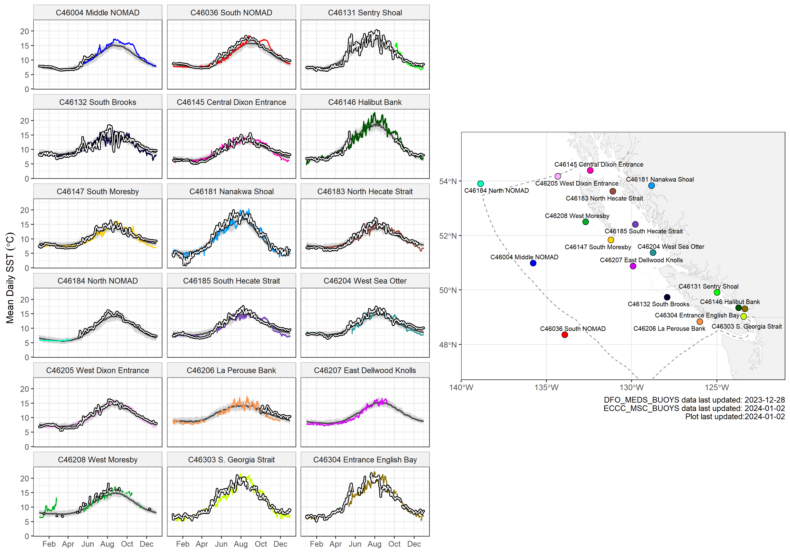
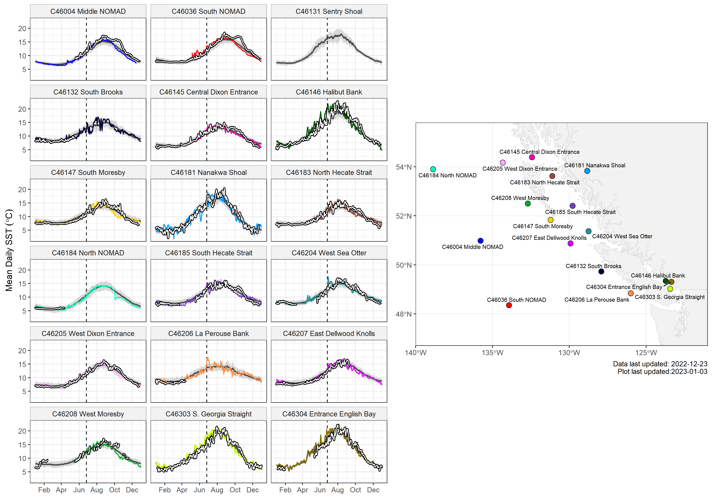

---
## Sea Surface Temperature in the Northeast Pacific
---

There are differing start dates in data collection between buoys, as well as many having gaps in the surface temperature records from maintenance or quality control issues. Observations during 1991-2020 were used to calculate the climatology at each buoy.

### 2022-2023 buoy temperature plots

The white lines outlined in black are daily mean observations from 2023.
The 2022 daily mean SST at each buoy are shown as coloured lines, plotted over the buoy climatological mean (grey line) with 10th and 90th percentiles (grey shading). 

### 2021-2022 buoy temperature plots

The white lines outlined in black are daily mean observations from 2022. 
The 2021 daily mean SST at each buoy are shown as coloured lines, plotted over the buoy climatological mean (grey line) with 10th and 90th percentiles (grey shading). 
The beginning of the 2021 "Heat Dome" heatwave is delineated by a dashed vertical line on 2021-06-26. 

