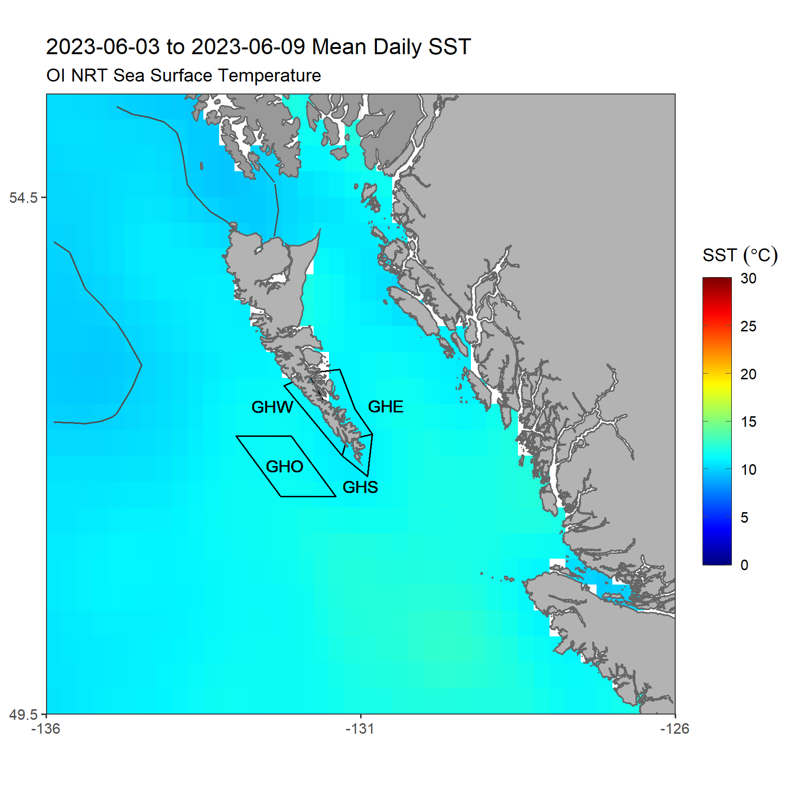
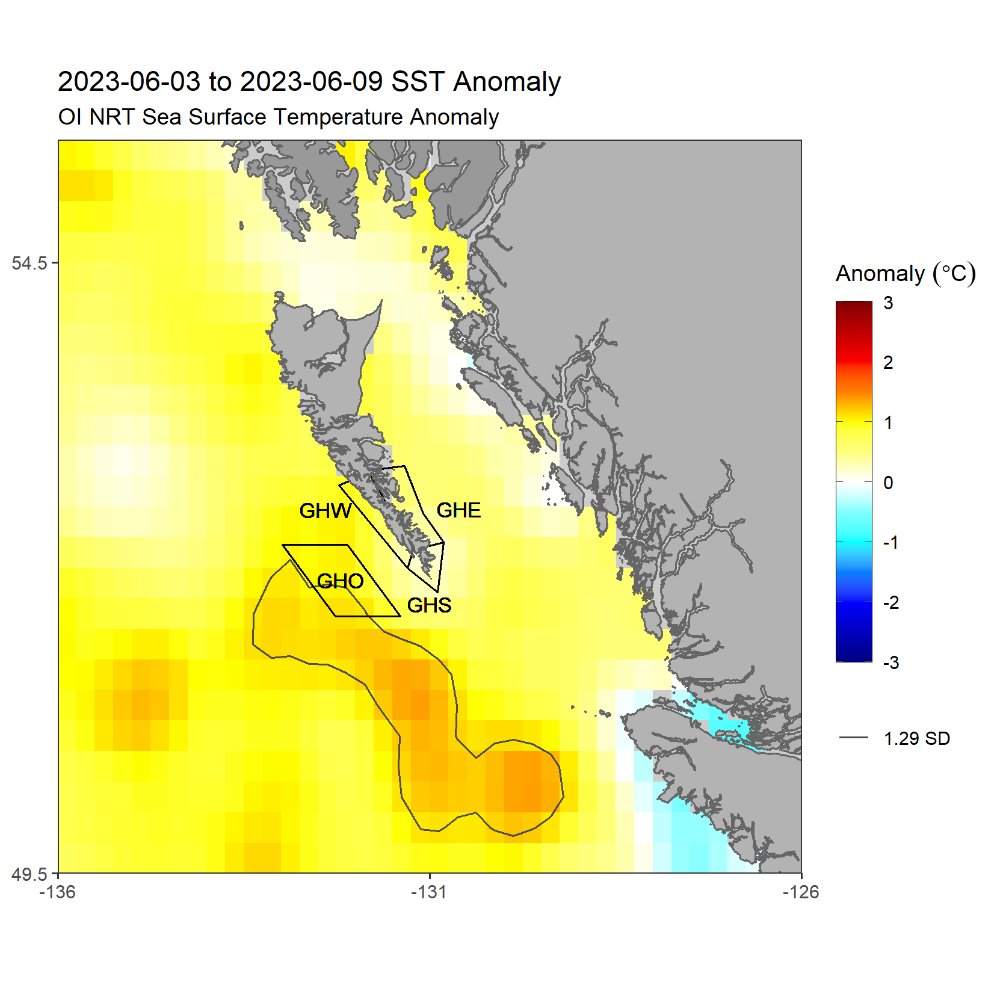
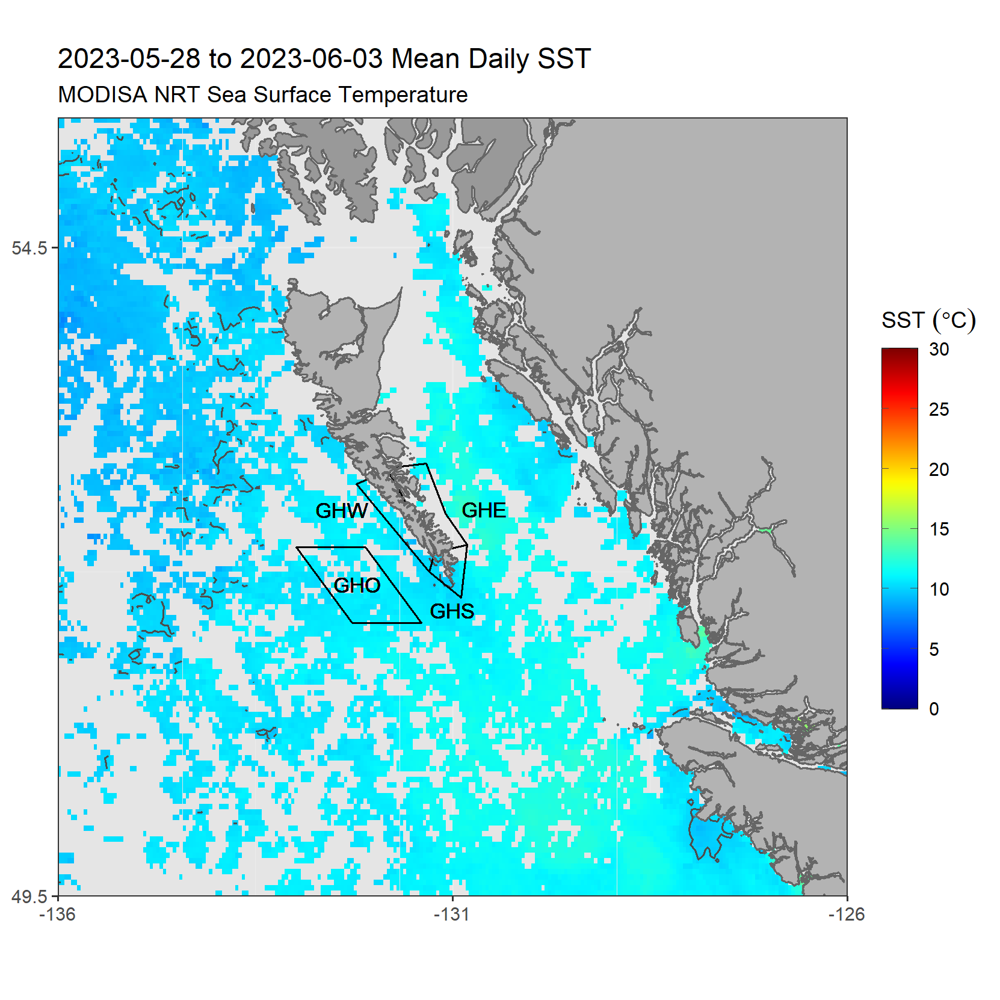
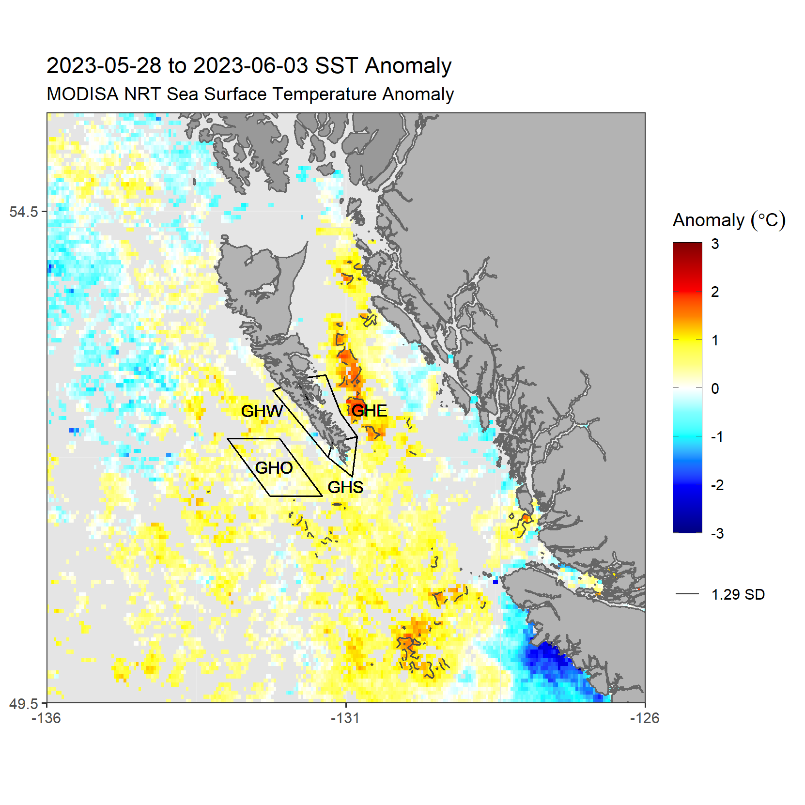
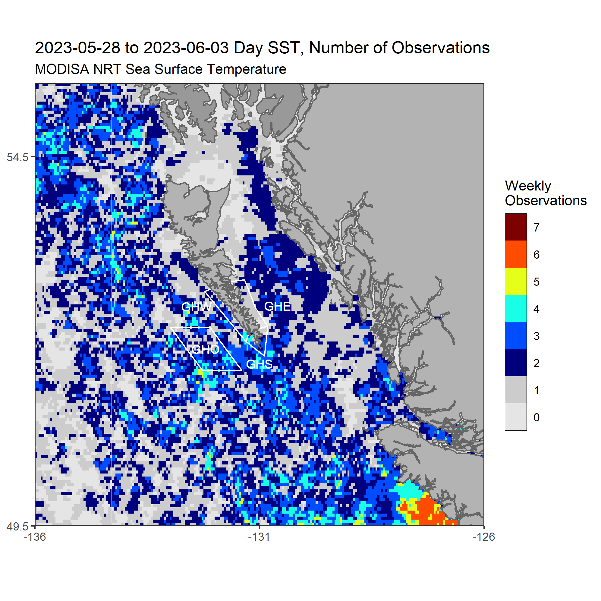

Maps focused on the Pacific near Haida Gwaii, B.C. The data shown on these maps are identical to the [Pacific SST Monitoring page](https://github.com/BIO-RSG/Pacific_SST_NRT_Monitoring/). The map data can be downloaded in .rds format [here](https://github.com/BIO-RSG/Pacific_SST_NRT_Monitoring/tree/main/data) (*Please let me know if you want .csv or other format instead*).
Some prior images will be stored [here](https://github.com/BIO-RSG/Pacific_SST_NRT_Monitoring/tree/main/figures/Haida_Gwaii) (images with with extension "HG").

### OISST:

This is an SST product interpolated using the "optimal interpolation" (OI) method. The spatial resolution is 0.25 degrees (~25 km per pixel).

 

### MODIS-Aqua Near Real-time SST:

The MODIS-Aqua NRT SST is not science quality, but used for rapid monitoring. The spatial resolution is approximately 4 km per pixel.
Pixels with few observations are more likely to show erroneous values, so be careful when interpreting the MODIS-Aqua anomaly maps (they are mainly provided as a separate comparison to the OI SST). A map with the number of observations at each MODIS-Aqua pixel from the current week is shown at the bottom.

  

##### Number of observations in current week of MODISA data:

 
