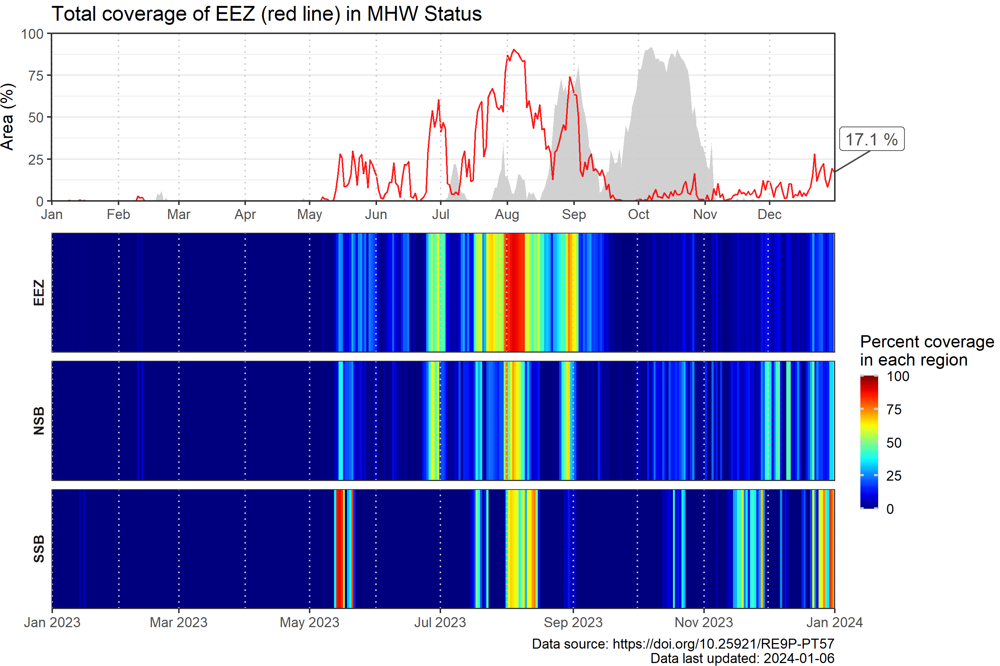

---
## Sea Surface Temperature in the Northeast Pacific
---
### Annual Marine Heatwave conditions

#### 2023

*The 2023 MHW spatial coverage of the B.C. Exclusive Economic Zone (EEZ, red) is below, with 2022 coverage shown in grey. The stripes indicate percent area of the EEZ, Northern Shelf Bioregion (NSB) and Southern Shelf Bioregion (SSB) in MHW status for 2023.* 

 

###### Click here to view map

 

